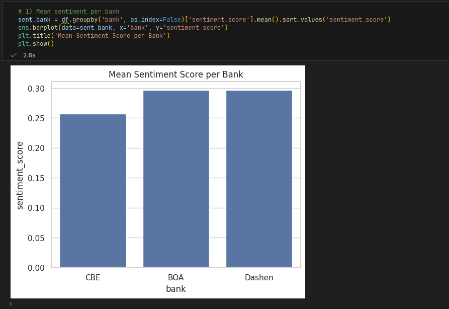
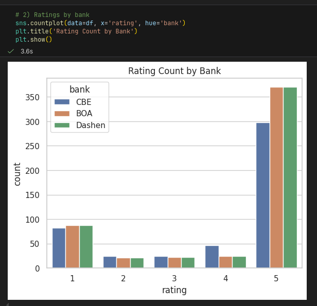
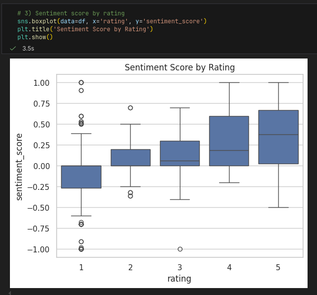
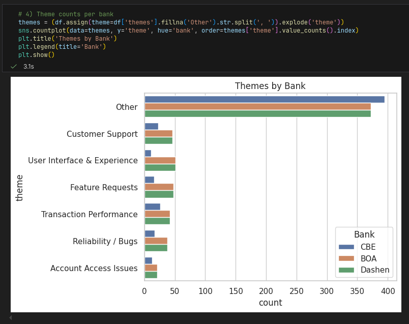
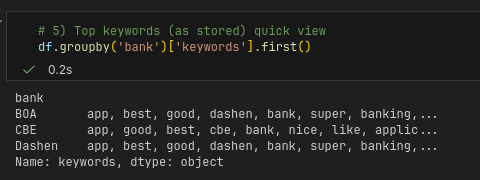

Customer Experience Analytics – Final Report

Objective
Analyze Google Play reviews for CBE, BOA, and Dashen to find what users like, what hurts, and how to improve the apps.

Data & Methods
- Reviews scraped from Google Play (600+ per bank).
- Cleaning: duplicates removed, dates to YYYY-MM-DD.
- Sentiment: TextBlob polarity → label and score.
- Text preprocess: tokenization, stop-words, lemmatization.
- Keywords: TF-IDF (1–2-grams) per bank.
- Themes: simple rules from keywords/text (e.g., login, slow, crash, UI, support, features).

Results (Short)
- Mean sentiment by bank and rating.
- Common themes show access issues, performance (slow/transfer), reliability (crash), and UI points.
- Examples visible in the notebook plots.

Drivers & Pain Points (Examples)
- CBE: fast actions praised; login and timeouts show up.
- BOA: super app features liked; performance and errors mentioned.
- Dashen: smooth transfers noted; some crashes and OTP problems.

Recommendations (Examples)
- Improve login and OTP flows; add clearer error messages.
- Speed up transfer and balance updates; cache key screens.
- Fix common crash paths; add basic diagnostics.
- Polish UI for common flows; small microcopy changes.

Ethics & Limits
- Reviews can be biased (more negative posts, duplicates). Not all issues reproduce.

Where to Put Screenshots
- Place images in `reports/images/` and use these names:
	- `sentiment_by_bank.png` (mean sentiment per bank)
	- `rating_by_bank.png` (rating count by bank)
	- `sentiment_by_rating.png` (sentiment vs rating)
	- `themes_by_bank.png` (themes count)
	- `top_keywords.png` (top keywords table screenshot)

Screenshots

References
- Google Play Scraper: https://github.com/JoMingyu/google-play-scraper
- Pandas: https://pandas.pydata.org/
- Seaborn: https://seaborn.pydata.org/
- Matplotlib: https://matplotlib.org/
- TextBlob: https://textblob.readthedocs.io/en/latest/
- NLTK: https://www.nltk.org/
- scikit-learn TF-IDF: https://scikit-learn.org/stable/modules/feature_extraction.html#text-feature-extraction
Customer Experience Analytics – Final Report

Business Context
We analyzed Google Play reviews for CBE, BOA, and Dashen to find what users like or struggle with, and suggest fixes.

Data & Method
- Scraped reviews via `google-play-scraper` (3 apps).
- Cleaned data (duplicates removed, dates to YYYY-MM-DD).
- Sentiment: TextBlob polarity → negative / neutral / positive.
- Keywords: TF-IDF (1–2 grams) per bank.
- Themes: Rule-based grouping (Account Access, Transaction Performance, UI/UX, Reliability, Support, Feature Requests).

Core Results
- Sentiment covers most reviews; distribution differs by bank.
- Themes show recurring issues: login/OTP, slow transfers, app crashes.
- Ratings align with sentiment: lower stars have lower polarity.

Visuals (Screenshots)
- Final sentiment per bank: `reports/images/final_sentiment_per_bank.png`
- Rating distribution per bank: `reports/images/final_rating_dist_per_bank.png`
- Mean sentiment by star rating: `reports/images/final_sentiment_by_rating.png`
- Themes by bank: `reports/images/final_themes_by_bank.png`
- Top keywords per bank (table): `reports/images/final_keywords_table.png`

Drivers & Pain Points (Examples)
- Drivers: simple flows, quick transfers, stable sessions.
- Pain points: login errors, slow processing, random crashes.

Recommendations (Per Bank)
- CBE: improve login stability (OTP handling), speed up transfer steps.
- BOA: reduce app crashes on older phones, lighten UI load.
- Dashen: optimize transfer confirmation time, add clearer error messages.

Ethics & Limits
- Reviews can be biased (complaints more vocal). Scraping limits may miss older data.

Appendix (How to Reproduce)
- Run: scrape → preprocess → sentiment/keywords → themes → summaries.
- See `README.md` for commands.

References
- Google Play Scraper: https://github.com/JoMingyu/google-play-scraper
- Pandas: https://pandas.pydata.org/
- Seaborn: https://seaborn.pydata.org/
- Matplotlib: https://matplotlib.org/
- TextBlob: https://textblob.readthedocs.io/en/latest/
- NLTK: https://www.nltk.org/
- scikit-learn (TF-IDF): https://scikit-learn.org/stable/modules/feature_extraction.html#text-feature-extraction
